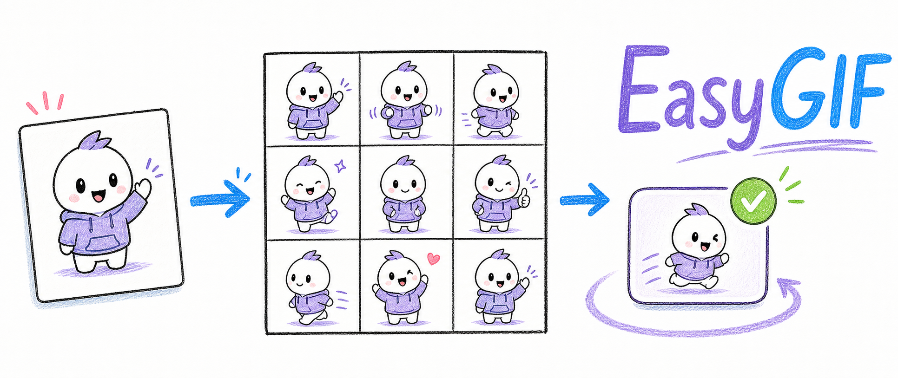

<p align="center">
  
</p>

<p align="center">
  <a href="SKILL.md"></a>
  <a href="scripts/validate_output.py"></a>
  <a href="tests/test_easygif.py"></a>
</p>

# EasyGIF

把一张静态图变成自然、可控、可交付的动图或视觉动效素材。

EasyGIF 是一个面向 Codex 的通用视觉动效 skill。它不要求用户先判断自己属于“动物、人物、游戏道具或表情包”哪一种场景，而是先分析画面中的运动范围、连续性、透明度、构图和交付约束，再选择宫格、局部图层、关键帧、视频抽帧或插帧路线。

## 一分钟开始

先检查本地能力：

```powershell
python scripts/probe_backends.py
```

然后让 Codex 使用仓库根目录的 `SKILL.md`：

```text
请使用 EasyGIF，把这张图片变成一个自然循环的动图。
如果我没有描述动作，请先根据画面设计一个低风险、可循环的动作。
保持原图比例，不要裁切；最终输出经过帧连续性和文件大小检查。
```

## 它如何工作

1. **预检**：记录输入尺寸、透明度、主体与背景不变量，以及用户的交付目标。
2. **动作编译**：把自然语言或自动推断的动作转成 Motion IR，包括主动作、微动作、锁定区域和时间阶段。
3. **能力路由**：按空间范围、运动连续性、输入来源、透明度和预算选择后端。
4. **确定性处理**：切帧、合成、插帧、比例保护、编码和压缩由仓库脚本完成。
5. **证据复核**：输出 geometry、temporal、region、budget、manifest 等报告；失败时生成下一步修复计划。

## 结果长什么样

每个任务都可以保留一条可复核链路：

```text
原图 / 参考图
    → Motion IR 与 route plan
    → 宫格、关键帧、局部层或视频帧
    → GIF / WebP / MP4 / 精灵图 / PNG 帧
    → validation reports + manifest.json
```

常见产物：

| 产物 | 用途 |
|---|---|
| `route.json` | 记录选择的表示方式、后端、fallback 和验证器 |
| `frames/` 或 `keyframes/` | 保留可检查的原始帧序列 |
| `contact-sheet.png` | 检查宫格边界、主体一致性和动作节奏 |
| `output.gif` / `output.webp` / `output.mp4` | 最终交付文件 |
| `manifest.json` | 保存输入、动作、策略、尺寸、帧数和验证结果 |
| `repair-plan.json` | 验证失败后的安全修复路线 |

## 核心脚本

| 脚本 | 作用 |
|---|---|
| `scripts/motion_recipe.py` | 用户未指定动作时生成保守的动作配方 |
| `scripts/select_strategy.py` | 选择宫格、图层、关键帧、视频或插帧路线 |
| `scripts/grid_plan.py` | 自适应判断 2×2、3×3、4×4 等宫格 |
| `scripts/optimize_gif.py` | 在实际字节预算下优化 GIF |
| `scripts/validate_grid_geometry.py` | 防止错误宫格导致裁切或比例变化 |
| `scripts/temporal_validate.py` | 检查帧间突变和循环边界 |
| `scripts/region_validate.py` | 检查非目标区域是否被误改 |
| `scripts/repair_plan.py` | 将失败报告编译成下一步修复动作 |
| `scripts/write_manifest.py` | 写出可复核的 manifest |

## 开发与测试

```powershell
python -m unittest discover -s tests -v
python "$env:USERPROFILE\.codex\skills\.system\skill-creator\scripts\quick_validate.py" .
```

当前默认保持 `contain` 比例适配；除非用户明确要求，EasyGIF 不会用裁切或拉伸掩盖宫格几何错误。FILM 只用于不透明、同机位的关键帧；透明主体优先走 alpha-safe 图层或宫格路线。

## 参考思想

仓库的组织方式参考了 [Rimagination/thu-digitizer](https://github.com/Rimagination/thu-digitizer) 的几个原则：统一预检入口、机器可读的能力注册、确定性执行、证据化产物、保守拒绝和可复核的项目画廊。EasyGIF 将这些原则应用到视觉动效生成，而不是图表数据提取。

## 状态

Incubating：核心自适应路由、宫格/图层/关键帧处理、P0–P3 质量门禁已经可用，后续继续扩展视频生成后端和更多 gallery 案例。
