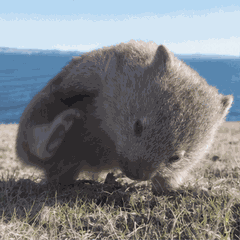
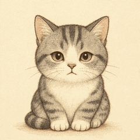

# EasyGIF 案例画廊

这些案例用于展示 EasyGIF 对不同应用场景的自适应处理方式。

## 微信表情包：袋熊挠屁股后看镜头

以 3×3 关键帧为参考，保持同一只动物、同一机位和同一背景，只让前爪、眼睛和身体产生低幅度动作。

## 手绘插画：猫猫打哈欠

保持线稿、体型、耳朵、胡须、爪子和纸张背景不变，只让眼睛、嘴巴和胸口完成一段慢速打哈欠动作。

## 电影感视觉

保持城市剪影和画面构图不变，让光束和空气感缓慢流动。

